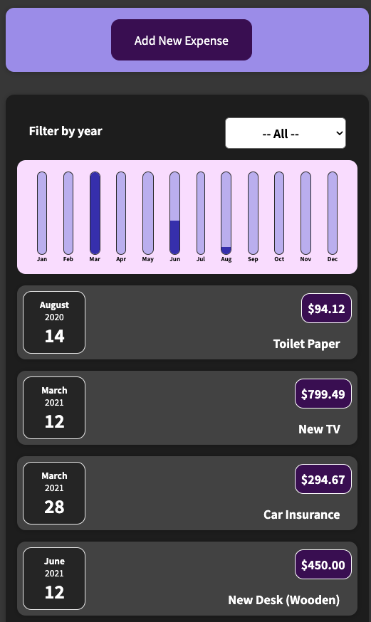
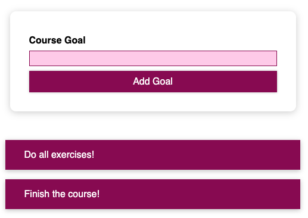
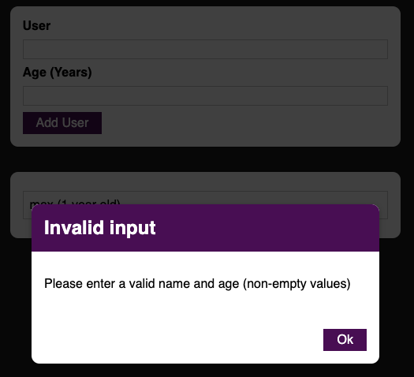
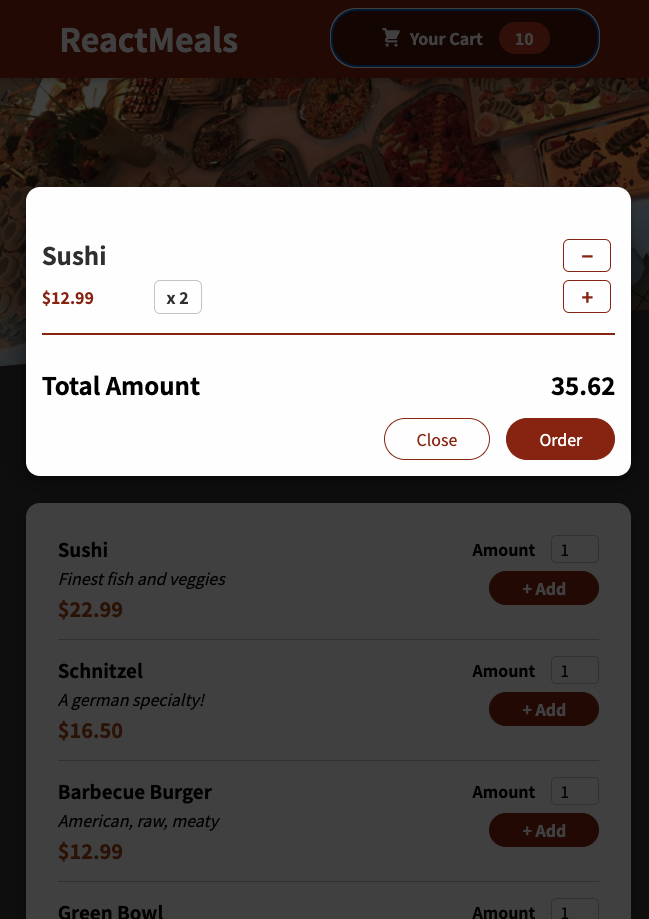
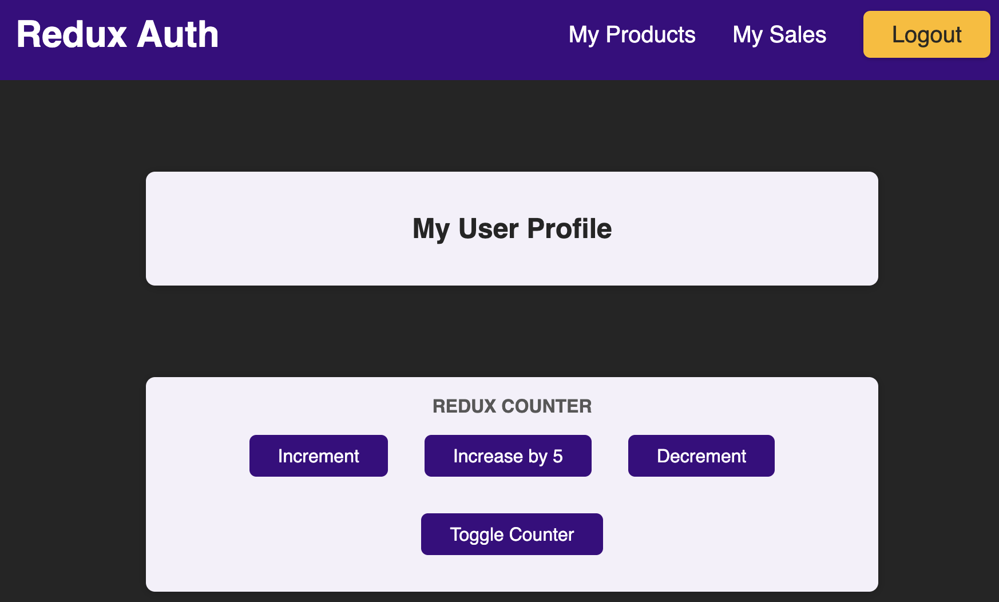
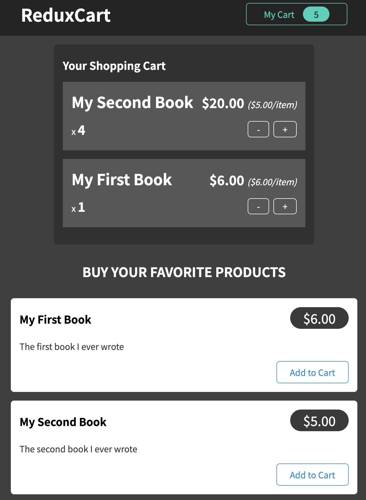

# React Complete Guide

Learning Reactjs, Hooks, Redux, React Routing, Animations, Next.js

## App 1: Expense Tracker

Basic expense tracker app to study components, states, styling and debugging



## App 2: Course Goals Input

Practice basic states and validation



## App 3: User Age Form

Practice more form input with modal box validation, learn custom wrapper, Fragment, React `Portal` & `Ref`s



## App 4: Login admin

Learn `useEffect` (eg. use to store data in browser storage, send http requests, set & manage timers),
`useReducer` (for more complex state eg. if you got multiple states, multiple ways of changing it or dependencies to other states and need more powerful state management)
`useContext` (to manage site wide state, create a context `React.createContext(...)` and use `ctx.Provider` to wrap the consuming components and consume it using `ctx.Consumer` or `useContext` hook)
useRef with `React.forwardRef` component func to use `useImperativeHandle` (I'm lost there)


Context limitation:

- React context is NOT optimised for high frequency changes
- should not be used to replace ALL component communications and props

## App 5: Food Order

Practicing what we've learn so far in a slighter bigger app.



## How React works behind the scene

- React is a JS library for building user interfaces, manages components, states. React is all about components - uses components to updates user interfaces
- ReactJS does not know anything about the browser/web, it only knows how to work with components and states, props, ctx etc.
- React determines how the component tree looks like and what it should look like. (Virtual snapshots)
- ReactDOM is interface to the web; receives the differences (ie. required changes) and then manipulates the real DOM
- ReactDOM works with the real DOM and responsible for bringing up what the user sees
- Whenever state, props, or context of a component changes, that component function is re-executed and re-evaluated by React
- Re-Evaluating Components !== Re-Rendering the DOM
- Changes to the real DOM are only made for differences between evaluations
- Virtual DOM Diffing - finding out the difference between two snapshots of previous and current evaluation results

## Error Boundaries

- To pass errors between components since try-catch cannot be used
- Must use class based component to create `ErrorBoundary` component and implements `componentDidCatch` lifecycle method
- Cannot add to functional component and there's no equivalent to functional component at the moment
- `componentDidCatch` lifecycle method will be trigger whenever a child component throws an error

```
import { Component } from 'react'

class ErrorBoundary extends Component {
  constructor() {
    super();
    this.state = { hasError: false }; // or whatever state you want
  }

  componentDidCatch(error) {
    // Do whatever you want with the error eg. log it or send it somewhere
    this.setState({ hasError: true })
  }

  // return children so we can wrap ErrorBoundary around the components
  // which should be protected by that component
  render() {
    if(this.state.hasError) {
      return <p>Something went wrong</p>
    }
    return this.props.children;
  }
}
```

## App 6: Movies

Try out a simple HTTP GET and POST integration via test endpoints.

## App 7: Tasks with Custom Hooks

- Outsource stateful logic into reusable functions. Unlink regular functions, custom hooks can use other React hooks and React state
- name the custom hooks with `use` prefix eg. `useCounter`
- states created in a custom hooks are independent to calling components and not shared across components
- can call the custom hooks as any other functional components

## App 8: Form validations with Custom Hook

## App 9: Redux

What is `Redux`? Redux is a state management system for cross component or app wide state.
3 kinds of states:

- `local state`: state that belongs to a single component. Should be managed component-internal with useState or useReducer
- `cross-component stat`e: state that affects multiple components eg. open/closed state of a modal overlay. Requires `prop chains` or `prop drilling`
- `app-wide state`: state that affects the entire app (most/all components) eg. user authentication status. Also requires `prop chains` or `prop drilling`

### React Context has potential disadvantages

- complex setup / management depending on complexity of the app, can lead to deeply nested JSX code and/or huge Context Provider components
- performance - it's not optimised for high frequency state changes

### Core Redux Concepts

- has `one central data (state) store`. We don't need to directly manage the store
- Components setup `subscriptions` to central store. Whenever data changes the store notifies components, components get the data they need (a slice of redux store) for their usage.
- Components NEVER directly manipulate the data. We use Reducer function, which is responsible for mutating (changing) the store data.
- Reducer function is NOT useReducer hook. It's a general concept
- Components trigger/dispatch certain `Actions`
- An action is a simple js object which describe the kind of operation the reducer should perform

### To use Redux with React

```
npm install redux react-redux
```

- Create a `store` folder in the `src` folder to store redux related code files
- The reducer func, should NEVER mutate the state, instead overwrite the state to return a brand new state; always copy and create new obj to avoid unexpected behaviors.

### To use with Redux Toolkit



You can uninstall `redux` and install `@reduxjs/toolkit`. Redux is already included in Redux Toolkit.

### Side Effects, Async Tasks & Redux

- Reducers must be `pure`, `side-effect-free`, `synchronous` functions
- Input (Old State + Action) => Output (New State)
- Where should side-effects and async tasks be executed?

  - Inside the `components` (eg. useEffect())
  - Inside the `action creator`

## App 10: Redux - more practice

Practice more on redux toolkit store, slice, reducer and related hooks.



### Fat Reducers vs. Fat Components vs. Fat Actions

Where should our logic (code) go?

- `Synchronous`, side-effect free code (ie. data transformations):

  - Prefer `Reducers`
  - Avoid `Action Creators` or `Components`

- `Async` code or code with side-effects:

  - Prefer `Action Creators` or `Components` (inside `useEffect`)
  - Must NEVER use `Reducers`

### What is a `Thunk`?

Is a function that delays an action until later.
An action creator function that does NOT return the action itself but another function which eventually returns the action.

## React Router

```
npm install react-router-dom
```

User `createBrowserRouter` to configure the routes definitions obj array and `RouterProvider` to return the route definitions in jsx

Route obj can have:

- `path`,
- `element` jsx page to render,
- `errorElement` error page to render,
- `children` nested child routes definition array
- root level default route can be defined with empty path `path: ''` or using `index: true`

```
const router = createBrowserRouter([
  {
    path: '/',
    element: <RootLayout />,
    errorElement: <ErrorPage />,
    children: [
      {
        index: true,
        element: <HomePage />,
      },
      {
        path: 'events',
        element: <EventsRootLayout />,
        children: [
          { index: true, element: <EventsPage /> },
          { path: ':id', element: <EventDetailPage /> },
          { path: 'new', element: <NewEventPage /> },
          { path: ':id/edit', element: <EditEventPage /> },
        ],
      },
    ],
  },
]);

function App() {
  return <RouterProvider router={router} />;
}
```

### Link, NavLink, useNavigate

- can use `Link` or `NavLink` or dynamically binded `useNavigate` hooks
- `NavLink` is used when you want to highlight the current or active link using the `isActive` object attribute and `end` element to specify root node
- `Link` is used when there is no special style or highlighting is required
- Use the `NavLink` or `Link` when you need links that are routing to pages that belong to your application. For external links, `a` is preferrable.
- `useNavigate` hook in event handlers or dynamic link creations

```
<ul className={classes.list}>
  <li>
    <NavLink
      to='/'
      className={({ isActive }) => (isActive ? classes.active : '')}
      end>
      Home
    </NavLink>
  </li>
  <li>
    <NavLink
      to='events'
      className={({ isActive }) => (isActive ? classes.active : '')}>
      Events
    </NavLink>
  </li>
</ul>

const navigate = useNavigate();

const navigateHandler = () => {
  navigate('products');
};

```

### Outlet

`Outlet` element is used as a placeholder and used in parent route elements to render their child route elements to allow nested UI.

```
const RootLayout = () => {
  return (
    <>
      <MainNavigation />
      <main>
        <Outlet />
      </main>
    </>
  );
};
```

### loader, useLoaderData, useNavigation, useRouteError

React router v6 or higher, there is a extra property, `loader` from the route definition for fetching data.

```
{ index: true, element: <EventsPage />, loader: () => { return []; } },
```

- `loader` is a property that wants a function as a value. That function will be executed by react router whenever a user is visiting that route. ie. just before element/jsx code is rendered, the loader function will be executed. You can use the loader function to load and fetch data for the route.
- loader func can return any type of data. Also can return a browser `Response` obj
- loader code is not execute on server, it's all client side execution
- Use `useLoaderData` hook to access data returned by the loader in the component or direct child components. It's a special hook to access closest loaded data.
- `useNavigation` hook provide route transition states. Its `state` property provides `idle`, `loading` or `submitting`
- loader func can throw an error obj and react router passes the error to the closest `errorElement`
- `useRouteError` hook to access the error object passed from the react router loader. The shape of the obj depends on whatever you throw in the loader func.
