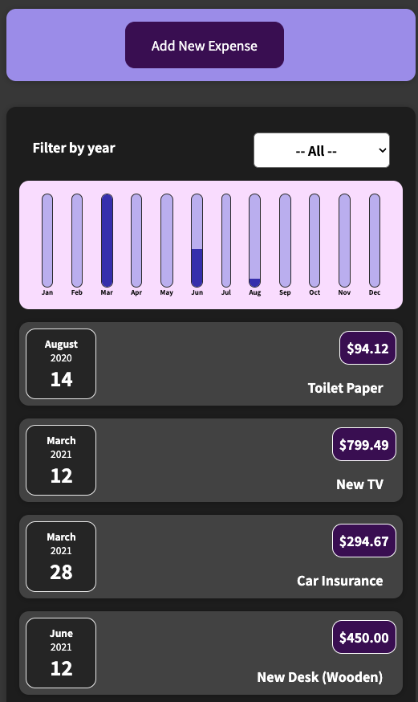
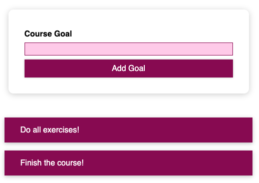
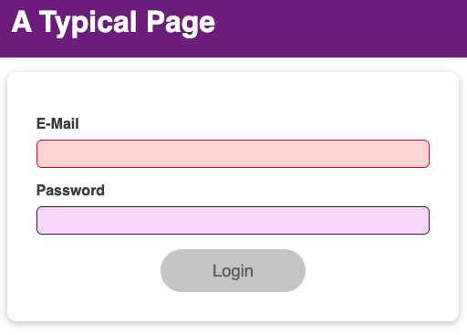
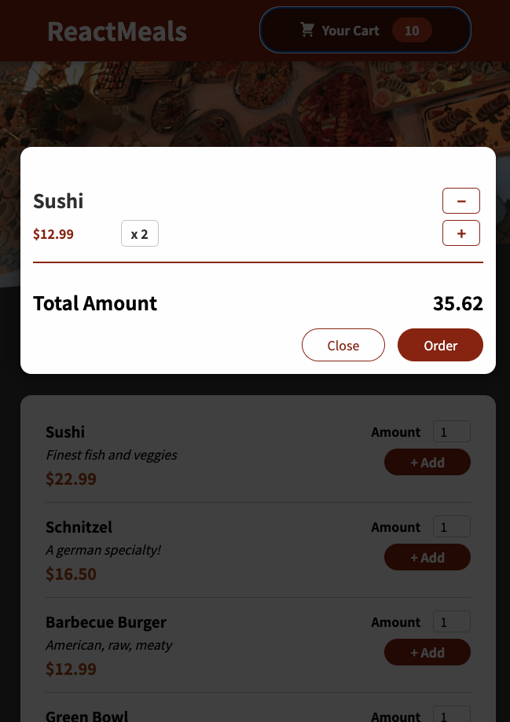

# React Complete Guide

Learning Reactjs, Hooks, Redux, React Routing, Animations, Next.js

## App 1: Expense Tracker

Basic expense tracker app to study components, states, styling and debugging

## App 2: Course Goals Input

Practice basic states and validation

## App 3: User Age Form

Practice more form input with modal box validation, learn custom wrapper, Fragment, React `Portal` & `Ref`s

## App 4: Login admin

Learn `useEffect` (eg. use to store data in browser storage, send http requests, set & manage timers),
`useReducer` (for more complex state eg. if you got multiple states, multiple ways of changing it or dependencies to other states and need more powerful state management)
`useContext` (to manage site wide state, create a context `React.createContext(...)` and use `ctx.Provider` to wrap the consuming components and consume it using `ctx.Consumer` or `useContext` hook)
useRef with `React.forwardRef` component func to use `useImperativeHandle` (I'm lost there)

Context limitation:

- React context is NOT optimised for high frequency changes
- should not be used to replace ALL component communications and props

## App 5: Food Order

Practicing what we've learn so far in a slighter bigger app.

